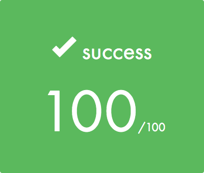

# roger-skyline-1

Roger-skyline-1 follows Init (basic commands and first reflexes in system and network administration). It will be a concrete example of the use of those commands and will let us start our own first web server.

[Subject](./roger-skyline-1.5.en.pdf)

## Optional part

I bring up a part of Elastic stack (Filebeat, Elasticsearch and Kibana) to aggregate logs from Apache server.

